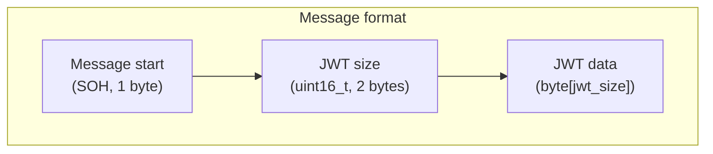

# Kiseki.Arbiter

Provisions Aya servers for a Kiseki instance

## TCP message format

## License

Kiseki.Arbiter is licensed under the [AGPLv3 license](https://github.com/kiseki-lol/arbiter/blob/trunk/LICENSE.md). A copy of it has been included with Kiseki.Arbiter.
