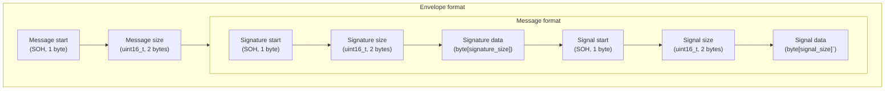

# Kiseki.Arbiter

Manages Kiseki game servers

## TCP envelope format

## License

Copyright (c) Kiseki 2023. All rights reserved. Not for public use.

Kiseki.Arbiter is adapted from [@ProjectPolygon/PolygonGSArbiter-foss](https://github.com/ProjectPolygon/PolygonGSArbiter-foss), a project licensed under the [MIT license](https://github.com/ProjectPolygon/PolygonGSArbiter-foss/blob/main/LICENSE).
